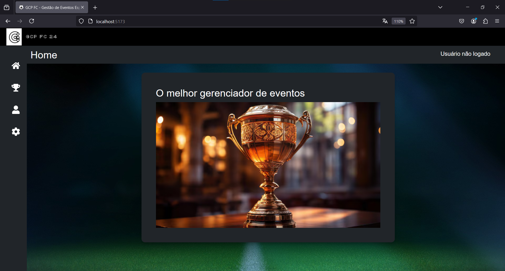

# Gestor de Eventos




O objetivo do projeto foi desenvolver uma aplicação web com a finalidade de gerenciar Eventos.

## 🛠 Tecnologias

As seguintes ferramentas foram usadas na construção do projeto:

* React;
* Bootstrap;
* Vite;
* React Icons;
* React-Router-Dom;
* Jest;
* TypeScript;
* Firebase; e
* VSCode.

* Listagem ordenadas por Título.

## 🚀 Como executar o projeto

```bash

# Clone este repositório
$ git clone https://github.com/Gustavo-Cruz-Pinheiro/gestor-eventos

# Acesse a pasta do projeto no seu terminal/cmd
$ cd gestor-eventos

# Instale as dependências
$ npm install

# Execute a aplicação em modo de desenvolvimento
$ npm run dev

# A aplicação será aberta na porta:3000 - acesse http://localhost:3000

```

## Autor

Gustavo Cruz Pinheiro

### Me siga nas redes sociais

<a href="https://github.com/Gustavo-Cruz-Pinheiro"></a>
<a href="https://www.instagram.com/gusttavo.cruz_"></a>
<a href="https://www.facebook.com/gustavocruzpinheiro"></a>
<a href="https://www.linkedin.com/in/gustavo-cruz-pinheiro-61b852217/"></a>
